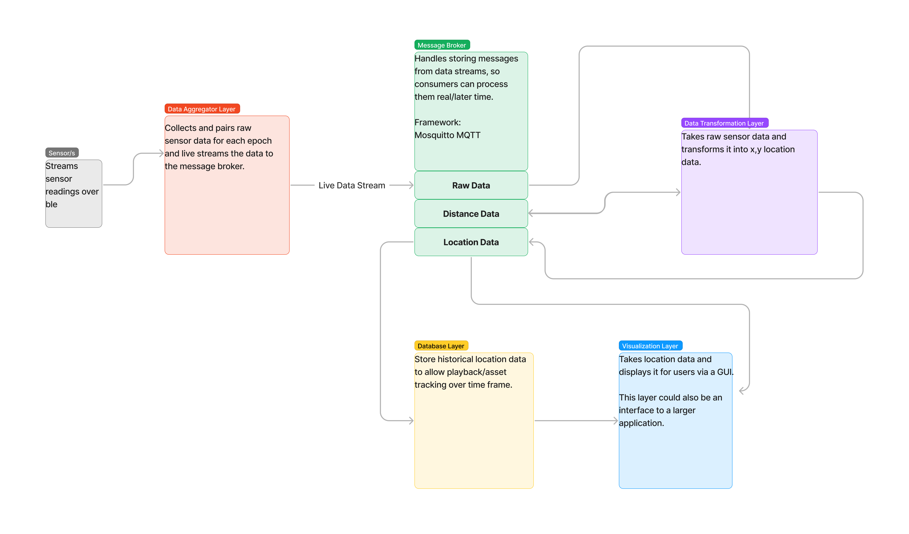

# Source Code Folder
**To run application, update config.json in the src folder with your unique configuration parameters. Then run:**  

**python3 initialize.py**
- *Starts the client process that initializes sensors and collects and transforms data.*  

**python3 visualization-PyQt.py**   
- *Starts the visualization processes to start GUI to view live data.*  

------
  
 

| Subdirectory Name | Description |
|---|---|
|app| Main python package, all other directories are sub-packages of the app package.|
| - Aggregator | Handles configuring and initializing platform independent senors and collecting raw data.|
| - Database |Handles how to store historical and current location data. Yet to be implemented |
| - lib |Helper classes|
| - Test| Modules for testing. Creating run logs and using run logs as inputs. |
| - Transformation |Responsible for transforming raw sensor data into x,y coordinates for an asset |
| - Visualization | Front end for visualizing asset location.|

------
 

## High Level Architecture

  
[Figma link to High Level Architecture](https://www.figma.com/file/QpHLV2bYdOp85XvTa2iev8/Capstone-High-Level-Architecture?node-id=0%3A1&t=K7Jq5j7D3IPaZaWu-1)  

------
 

## Call Graph

[Figma link to Call Graph](https://www.figma.com/file/Vp7uYtZlDxoxrRqdHUt4Oq/API-Call-Diagram?type=whiteboard&node-id=0%3A1&t=bzkpQCwWuvQsphzr-1)  
 

------
 

## config.json  

The config.json file holds many of the parameters to run the application. Each object in the file relates to some process that is run by the application and the key value pairs define some parameter or flag that is set by that process. Here is an explanation of the fields in config.json:

### **initialize.py** - Some default flags for the application.  
- **runtime:** If set to > 0 will run the application for that many seconds. If set to 0 will run the application indefinitely until SIGINT.  
- **use_testbed:** If set true application will use testbed_axle_length and testbed_wheel_diameters instead of chair values that are set in associated fields.  
- **test_old:** If set true the application will run using old data from a provided json or csv log file.
- **old_data:** Parameters that must be set in order to run the application with old data from a log file.
  - type: Either json or csv, though csv is mostly depreciated and the system should only use the json files that are created when should_log_output is set to true.
  - client_id: Name for client in the message broker, can be keep as default value unless it needs to be changed for debugging purposes.
  - topic_pub: Topic that the mocked old data messages should be sent to.
  - path: Absolute path to the location of the log file to run.
  - hz: Hz that the original data was collected at so as to mock the same application execution speed. 
- **should_log_output:** If set to true, the application will log each epoch of data collected and transformed to a json log file.
- **log_data**: Parameters that must be set in order to log app data to a json file.
  - client_id: Name for client in the message broker, can be keep as default value unless it needs to be changed for debugging purposes.
  - topic_sub: Topic that the data logging process should listen to; should be the end of the pipeline. 
  - log_path: Absolute path and name of where the log file will be saved.  

### **logger_process.py** - Flags and config for the error and info logging process.
- See [The Logging Cookbook](https://docs.python.org/3/howto/logging-cookbook.html#logging-to-a-single-file-from-multiple-processes) for in-depth explanations of logging multiprocess applications in python. 

### **linear_to_location_msg_handler.py** 
- **client_id:** Name for this process in the message broker, can be keep as default value unless it needs to be changed for debugging purposes.
- **topic_sub:** Topic this process should listen to.
- **topic_pub:** Topic this process should publish its results to.
- **testbed_axle_length:** Length in mm of a test bed or alternate device axle.
- **chair_axle_length:** Length in mm of main device axle.
- **filter_version:** Deprecated, could be used if custom filters are later developed to determine which ones to use.  

### **raw_to_linear_msg_handler.py**
- **client_id:** Name for this process in the message broker, can be keep as default value unless it needs to be changed for debugging purposes.
- **topic_sub:** Topic this process should listen to.
- **topic_pub:** Topic this process should publish its results to.
- **testbed_wheel_diameter:** Length in mm of a test bed or alternate device wheel diameter.
- **chair_wheel_diameter:** Length in mm of main device wheel diameter.
- **filter_version:** Deprecated, could be used if custom filters are later developed to determine which ones to use.

### **sensor_to_raw_msg_handler.py**
- **client_id:** Name for this process in the message broker, can be keep as default value unless it needs to be changed for debugging purposes.
- **topic_sub:** Topic this process should listen to.
- **topic_pub:** Topic this process should publish its results to.
- **testbed_l_mac:** MAC address of metawear sensor placed on left wheel of testbed device.
- **testbed_r_mac:** MAC address of metawear sensor placed on right wheel of testbed device.
- **chair_l_mac:** MAC address of metawear sensor placed on left wheel of main device.
- **chair_r_mac:** MAC address of metawear sensor placed on right wheel of main device

### **visualization_PyQt.py** - Config and flags for the GUI process frontend
- **client_id:** Name for this process in the message broker, can be keep as default value unless it needs to be changed for debugging purposes.
- **topic_sub:** Topic this process should listen to.
- **topic_pub:** Topic this process should publish its results to.
- **broker_host:** IP of the Mosquitto server.
- **port:** Port of the Mosquitto server.
- **map_path:** Path to a background map pgn image to overlay on GUI.
- **graph_title:** Title to display on graph.
- **gui_title:** Title to display on the GUI window title bar.
- **min_x:** Minimum value of x-axis (cm).
- **max_x:** Maximum value of x-axis (cm)
- **min_y:** Minimum value of y-axis (cm).
- **max_y:** Maximum value of y-axis (cm)
- **queue_length:** Maximum number of points displayed in line element of graph.
- **sample_data_mod:** Modulo used to set sample rate of incoming data.
- **draw_line_frequency:** How frequently line is redrawn on the graph (milliseconds).
- **show_line:** If true displays a line connecting points on the graph.
- **show_marker:** If true displays a marker for each point on the graph.

